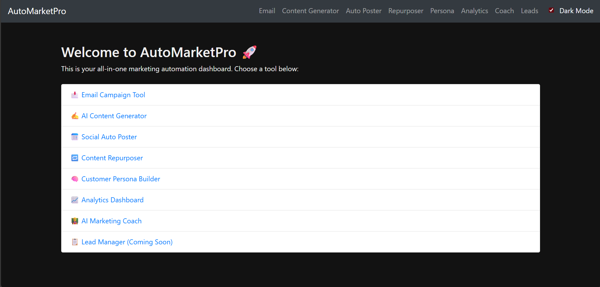
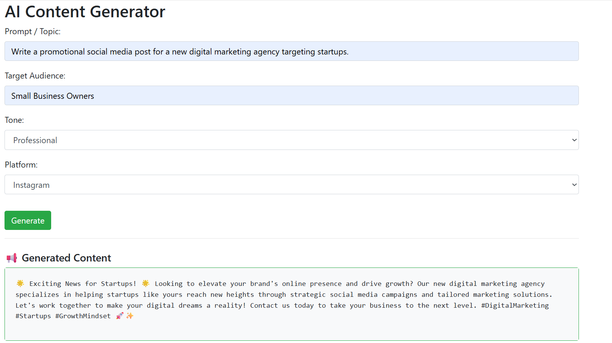

# 🚀 AutoMarketPro – AI-Powered Marketing Automation Tool

**AutoMarketPro** is a full-featured marketing automation dashboard built using Python, Flask, and OpenAI. It empowers freelancers, marketers, and small business owners to automate, schedule, generate, and analyze their marketing efforts from a single clean interface.

---

## 🌟 Key Features

| Tool                    | Description |
|-------------------------|-------------|
| 📩 **Email Campaign Tool**       | Send bulk emails using Gmail + CSV upload |
| ✍️ **AI Content Generator**      | Create professional posts, emails, and ad copy |
| 📅 **Auto Poster**               | Schedule social posts with text/image & save as drafts |
| 🔁 **Content Repurposer**       | Convert blogs into tweets, LinkedIn posts, and more |
| 🧠 **Persona Builder**          | Generate customer personas with pain points, triggers, goals |
| 📈 **Analytics Dashboard**      | Upload CSV, view charts + GPT-based marketing insights |
| 🧑‍🏫 **AI Marketing Coach**     | Ask GPT marketing questions & get expert answers |
| 📋 **Lead Manager**             | Placeholder module (coming soon) to manage and follow up leads |

---

## 📸 Screenshots

> Replace these with actual images or GIFs from your project

- 
- 
- 
- 

---

## ⚙️ How to Run Locally

1. **Clone the repository**

```bash
git clone https://github.com/yourusername/automarketpro.git
cd automarketpro
Install dependencies

bash
Copy
Edit
pip install -r requirements.txt
Set environment variables

Create a .env file in the root:

env
Copy
Edit
OPENAI_API_KEY=sk-xxxxxxxxxxxxxxxxxxxx
SECRET_KEY=yoursecretkey
Run the app

bash
Copy
Edit
python app.py
Visit: http://127.0.0.1:5000/

🧪 Sample CSVs for Testing
data/sample_marketing_data.csv

data/sample_leads.csv

📂 Folder Structure
php
Copy
Edit
automarketpro/
│
├── routes/         # Flask blueprints per module
├── utils/          # GPT + helper logic
├── templates/      # HTML pages
├── static/         # CSS, JS, charts, screenshots
├── data/           # Uploaded files, lead exports
├── app.py          # Main Flask app
└── README.md
🌐 Live Demo (Optional)
If deployed to Replit / Render, add here:

🔗 Live AutoMarketPro

💼 Who is it for?
Freelancers and digital marketers

Social media managers

Small business owners

Automation lovers

✍️ Author
Zain Farooq
Finance + Automation | Freelancing with Python & AI
GitHub · Fiverr · FintechZain

📌 Disclaimer
AutoMarketPro uses OpenAI's GPT via API. You must have your own OpenAI API key to use the AI tools.